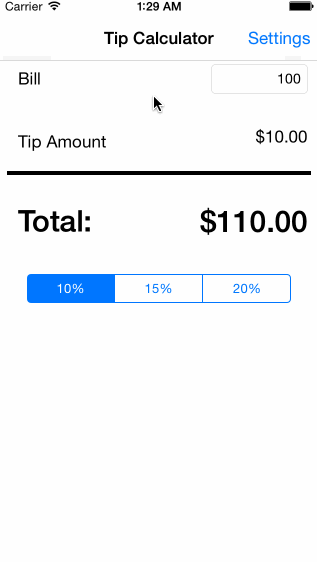

# TipCalculator

Time spent: 3.5 hours spent in total

Completed user stories:
* [x] Required: User can input the bill amount and then get the tip and total amout. 
* [x] Required: User were able to setting custom tip rate 
* [x] Optional: Custom tip rate was prefilled in textfield

Notes:

Walkthrough of all user stories:

GIF created with [LiceCap](http://www.cockos.com/licecap/).

